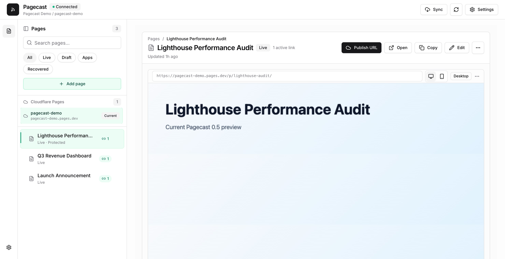

# Pagecast

Preview local HTML reports, Markdown docs, and static mini apps, then publish
them to shareable Cloudflare Pages URLs — from the terminal or your coding agent.

**Feature HTML:** <https://pagecasthq.pages.dev/>

<p align="center">
  
</p>

## About

Pagecast is a local-first publishing tool for agent-generated reports and small
static web projects. Preview files, manage published versions, rename links,
re-sync updates, password-protect pages, and revoke old URLs — from a local
admin UI or headless `pagecast` commands.

The trust boundaries, state/target invariants, and corrected PR-lineage
decisions are recorded in [ARCHITECTURE.md](ARCHITECTURE.md).

**Good fits:** HTML reports and dashboards (Playwright, Lighthouse, coverage);
Markdown plans, docs, and release notes; static mini apps from `dist`/`build`/`out`;
coding-agent workflows that publish a finished artifact on request.

**Not a fit:** private scratch notes, or server-rendered apps that need a running
backend (export static assets first).

## Quick Start

Requires Node.js 20.19+ and a Cloudflare account for publishing. Run the exact
Pagecast 0.5.0 release without a global install:

```sh
npx pagecast@0.5.0
```

The versioned command is reproducible. Unversioned `npx pagecast` follows npm's
current `latest` tag. From a source checkout of `main`, run `npm start` instead.

This starts the local app and opens the admin UI:

- Admin UI — `http://pagecast.localhost:4173`
- Local preview/public origin — `http://pagecast.localhost:4174` (the admin
  embeds this separate origin; raw report HTML is never served by the admin
  origin)
- Pagecast Home — `~/.pagecast/home/` (Cloudflare target, publication registry,
  analytics settings, operation journal, and single-writer lease)
- Workspace metadata — `.pagecast/` in the current directory (workspace/source
  identity and mappings back to Home publications)

One OS user profile owns one Pagecast Home and Cloudflare subdomain. Run the CLI
from the relevant project so Pagecast can identify the workspace and source.
Use `--data-dir` only for an intentionally isolated CI/container profile.

### Upgrading from 0.4 to 0.5

- Stop any v0.4 foreground process with `Ctrl-C`. For a transient background
  process, switch versions explicitly:

  ```sh
  npx pagecast@0.4.0 background stop
  npx pagecast@0.5.0 background start
  ```

- If you installed the macOS login service, rerun
  `npx pagecast@0.5.0 background service install`. The LaunchAgent captures the
  exact Node and CLI paths, so restarting the old service does not upgrade it.
- Replace the unpacked Chrome extension with the matching 0.5.0 release folder
  (or the `extension/` folder from the same source checkout), then click
  **Reload** in `chrome://extensions`. The 0.5.0 extension negotiates the new
  admin-session token before publishing.
- Existing URLs, passwords, expiries, redirects, Cloudflare selections, and
  `.pagecast/` data remain readable. Existing word-only URLs are preserved as
  issued; Pagecast does not silently rotate them.
- A legacy publication whose Cloudflare account/project was never recorded is
  readable but cannot be synced, renamed, re-expired, or revoked until you
  select its original project and click **Attach selected project** for that
  link.
- On a genuinely fresh install, anonymous telemetry is enabled by
  default with a one-time disclosure. Disable it with
  `npx pagecast telemetry disable`, `PAGECAST_TELEMETRY=0`, or `DO_NOT_TRACK=1`.
  Existing saved choices and explicit environment overrides keep their behavior.

Want Pagecast waiting in the background instead of keeping a terminal tab open?

```sh
npx pagecast background start
npx pagecast open
```

On macOS, you can also make Pagecast feel like a tiny local app that survives
login/restart and opens without a visible port:

```sh
npx pagecast setup-local-url
```

That installs a local-only `pf` redirect for `http://pagecast.localhost` and a
user LaunchAgent that keeps the Pagecast server running after login. Pagecast
still runs internally on its normal port; it does not run the app as root or
occupy port 80 with a server process. Manage the pieces separately with:

```sh
npx pagecast local-url status
npx pagecast local-url remove
npx pagecast background service status
npx pagecast background service uninstall
```

Pagecast remembers the local ports in the Home config. If 4173/4174 are
busy the first time it starts, it falls forward to the next available pair and
keeps using that pair on future launches. The bundled extension discovers that
exact origin from the dashboard tab opened by Pagecast and remembers it; it does
not scan localhost ports. On first use of a fallback port, keep that dashboard
tab open long enough for discovery. The extension supports Pagecast's standard
`pagecast.localhost`, `localhost`, and `127.0.0.1` hosts; a server deliberately
bound to another loopback address (for example `127.0.0.2` or `::1`) still works
through the CLI/dashboard but is outside the extension's host permissions.

In the main admin canvas, confirm the suggested Home subdomain and click
**Connect Cloudflare**. Pagecast explains the exact scopes, starts Wrangler's
Cloudflare-hosted authorization flow, shows progress, and resumes Home creation
after consent. Cloudflare labels the authorizing application **Wrangler**.
Existing project selection remains in Advanced/Legacy settings; Pagecast never
silently adopts an unrelated project. From a clone, run `npm start`.

Prefer containers? Pagecast ships with Docker support — see [Run with Docker](#run-with-docker).

For advanced/headless setup, the lower-level command remains available:

```sh
npx pagecast pages setup --project your-pagecast-home
# multiple accounts? add  --account <account-id>
# automation? export CLOUDFLARE_API_TOKEN (scoped Pages:Edit) + CLOUDFLARE_ACCOUNT_ID
```

## Publish From The Terminal

```sh
# An HTML or Markdown file → a memorable /p/<slug>/ link (source folder included)
npx pagecast publish "/absolute/path/report.html" --json

# Set an expiry — 7d, 12h, or never (default 30d)
npx pagecast publish "/absolute/path/report.html" --expires 7d --json

# Force another URL, or explicitly update a known one
npx pagecast publish "/absolute/path/report.html" --new-link --json
npx pagecast publish "/absolute/path/report.html" --update <url-or-token> --json

# A built static project → publish its entry file
npm run build && npx pagecast publish ./dist/index.html --json

# A whole folder → replace a named Pages project directly (--branch defaults to main)
npx pagecast pages deploy ./dist --project my-static-site --json
```

The CLI's `pagecast publish` copies every non-hidden, non-symlink file under its
source folder, even when the entry HTML does not reference it. Every copied file
is reachable beneath the published URL, so publish from a clean folder and keep
credentials and source secrets elsewhere. MCP `publish_file` isolates the entry
file unless sibling assets are explicitly confirmed.

New links are **unlisted** by default: a memorable label plus a 128-bit opaque
capability (for example, `/p/hollow-paperclip-<32-hex-characters>/`). Anyone who
has the URL can view it; unlisted does not mean private. The admin UI's
**Short public link** toggle instead mints an intentionally easy-to-share,
guessable public drop. Renaming a link to a vanity slug without the 128-bit
suffix is also an explicit conversion to a public drop. Password protection is
the access-control option. Existing word-only links keep their original URL and
continue to resolve.

Pagecast records the actual production origin returned by Cloudflare rather
than assuming `<project>.pages.dev`, so a global hostname collision does not
leave links or social metadata pointing at the wrong host. Add `--json` for
agents and CI, and use the admin UI for link renaming, re-sync, revoke, and
build settings.

Agent publishing is context-aware. Pagecast identifies a managed publication by
workspace, canonical item, and a local hash of the agent context. Repeating an
explicit “Publish this as a Pagecast” request for the same item in the same
context updates the existing URL; another item or context creates a URL under
the same Home. Precedence is `--context-id`, `PAGECAST_CONTEXT_ID`,
`CODEX_THREAD_ID`, `CLAUDE_SESSION_ID`, then workspace/source fallback. Use
`--new-link` or `--update` to override matching. JSON reports `action`,
`publicationToken`, `contextMatched`, and `url`.

`pages deploy` is a separate whole-site operation. It replaces the contents of
the named Cloudflare Pages project and does not change the project selected for
managed `/p/...` publications. Use a separate project unless replacing the
managed publication site is intentional. Managed publication workflows record
incomplete Cloudflare/local reconciliation in the operation journal and surface
it for safe retry or manual action; direct `pages deploy` is stateless, so
inspect deployment history before retrying an ambiguous timeout.

Interactive publishing starts Wrangler authentication automatically and resumes
the original publish. In CI or with `--non-interactive`, `statusCode 401` is a
structured authentication-required result. `statusCode 409` means a conflict;
follow the returned message. Multiple accounts can be selected in the main Home
onboarding canvas.

## Activity and privacy

Enable analytics independently from the optional reactions bar in Settings.
Pagecast deploys a Worker plus D1 database to your Cloudflare account, migrates
existing aggregate KV totals, and instruments every active Home page. Each page
shows compact views, anonymous uniques, and last access beside its links, with a
link selector and recent events immediately below. The global **Activity** view
covers every Home link.

Detailed events include coarse country, region/city when Cloudflare provides
them, ASN/organization, device class, and referrer hostname. The Worker reads
`CF-Connecting-IP` transiently, immediately HMACs it with a per-Home secret, and
discards the raw address. Detailed events expire after 30 days; aggregate totals
remain. Analytics provides audit visibility, not named identity or access
prevention. An unlisted link is open to anyone who has its URL; use Pagecast
password protection when access control is required.

## Password Protection

Gate any published page behind a password — from the admin UI (the **Password
protection** toggle) or headlessly:

```sh
npx pagecast publish "/absolute/path/report.html" --password "your-password" --json
npx pagecast publish "/absolute/path/report.html" --no-password --json   # remove it
```

Enforced at the edge by a generated Cloudflare Pages Function, so a successful
protected publish gates every file of a multi-file report from its first live
deployment. Protection changes on an existing link take effect target by target
only after each replacement deployment succeeds. Cloudflare's immutable URLs
for older deployments are not retroactively gated; prune any historical
unprotected deployment that must stop being reachable. Crypto, security model,
and caveats: [PASSWORD-PROTECTION.md](PASSWORD-PROTECTION.md).

## Deploy History

Every publish or re-sync creates a new Cloudflare Pages deployment — an immutable
snapshot of your whole site at that moment, each with its own `<hash>.pages.dev`
URL. Over time these pile up. View and remove them from the admin UI
(**Settings → Deploy history**) or the terminal:

```sh
# List recent deployment snapshots (the newest production one is marked live)
npx pagecast pages deployments list --json

# Remove one snapshot by id (the live deployment is protected and can't be deleted)
npx pagecast pages deployments delete <id> --json

# Keep the N most recent (incl. live) and remove the rest
npx pagecast pages deployments prune --keep 5 --yes --json
```

Snapshots are whole-site, not per-page, so removing one never affects your live
site or your pages in Pagecast — it just frees up old `<hash>.pages.dev` URLs.
That also means expiry, password changes, and revoke apply to the production
site's replacement deployment; an older immutable deployment URL keeps the
bytes and gate state it originally shipped with until that deployment is
deleted. Prune history when those direct snapshot URLs must stop working.

## Use From Coding Agents

Pagecast ships a Codex-native skill and a portable Agent-Skills file. An
explicit “Publish this as a Pagecast” instruction publishes immediately and
returns whether the link was created or updated. A proactive agent suggestion
still asks once; a command-only request returns only the command.

```sh
# Codex
cp -R .codex/skills/publish-report ~/.codex/skills/

# Claude Code
/plugin marketplace add Amal-David/pagecast
/plugin install pagecast@pagecast

# Any other agent
cp plugin/skills/publish-report/SKILL.md /path/to/your-agent/skills/publish-report/SKILL.md
```

More detail in [plugin/README.md](plugin/README.md).

## Use Through MCP

Pagecast can run as a Model Context Protocol server, so MCP-capable agents can
publish generated HTML/Markdown, inspect known pages, and revoke links through a
bounded tool surface instead of shelling out to the CLI themselves.

For local agents, configure the stdio server:

```json
{
  "mcpServers": {
    "pagecast": {
      "command": "npx",
      "args": ["pagecast", "mcp"]
    }
  }
}
```

That command shares the same user-level Home, Cloudflare credentials, expiry,
and password-protection behavior as `npx pagecast publish`. Add
`"--data-dir", "/path/to/profile"` only when you intentionally want an isolated
MCP profile.

### MCP tools

| Tool | Purpose | Safety notes |
| --- | --- | --- |
| `status` | Show Cloudflare/Pagecast connection state. | Redacted by default; pass `verbose: true` only for trusted local clients. |
| `list_pages` | List locally known reports and published links. | Redacted by default; pass `verbose: true` only when local paths/build settings are safe to reveal. |
| `publish_content` | Publish supplied HTML or Markdown content. | Supports `mode: upsert|new|update`, `contextId`, and `publication`; deterministic upserts require `itemKey`. Without one, upsert creates a new link. |
| `publish_file` | Publish a local `.html`, `.htm`, `.md`, or `.markdown` file. | Uses canonical file identity for upserts and supports the same mode/context/publication controls. To include sibling assets, pass both `includeAssets: true` and `confirmAssets: true`. |
| `revoke_publication` | Take a published token offline and redeploy the Pages site. | Requires `confirm: true` because it changes a live URL. |

Example `publish_content` tool arguments:

```json
{
  "content": "<h1>Quarterly report</h1>",
  "filename": "quarterly-report.html",
  "label": "Quarterly report",
  "expires": "7d",
  "password": "optional-page-password"
}
```

Example `publish_file` with sibling assets intentionally included:

```json
{
  "path": "/absolute/path/report.html",
  "label": "Report with assets",
  "includeAssets": true,
  "confirmAssets": true
}
```

### Organization and VPN deployments

The MCP server is intentionally separate from the admin API. The admin API can
run local publish/build work and should stay loopback-only. Do not expose the
admin port to a VPN or shared network.

This release supports local stdio MCP. An org-hosted HTTP MCP endpoint or
VPN-only publishing target should be a separate hardening pass with an explicit
auth model, per-user authorization, audit logging, rate limits, and a threat
model for what the server is allowed to read and publish.

Putting a future MCP endpoint behind a VPN would control who can invoke
Pagecast; it would not by itself make the returned published URL VPN-only. For
restricted recipients today, use Pagecast password protection or protect the
Pages/custom domain with your organization's access layer.

## Run with Docker

A single image bundles the whole `pagecast` CLI, so it serves the admin dashboard
**and** runs every publish/deploy command — they are the same program.

```sh
# Serve the dashboard (build on first run, then open http://localhost:4173)
docker compose up --build
```

Release images are published to GHCR:

```sh
docker pull ghcr.io/amal-david/pagecast:latest
docker run --rm \
  -p 127.0.0.1:4173:4173 -p 127.0.0.1:4174:4174 \
  -v "$PWD/.pagecast:/app/.pagecast" \
  ghcr.io/amal-david/pagecast:latest serve
```

The local published-page preview is on `http://localhost:4174`, and your config +
publish history persist in `./.pagecast` (mounted as a volume).

**Publishing from a container uses an API token, not the dashboard's "Connect
Cloudflare" button** — that button opens a browser OAuth flow a container can't
complete. Copy `.env.example` to `.env`, add a scoped token, and `docker compose`
picks it up:

```sh
cp .env.example .env   # fill in CLOUDFLARE_API_TOKEN (+ CLOUDFLARE_ACCOUNT_ID)
```

Run any command headlessly (CI, servers) from the published image — mount your
working directory and pass the token through:

```sh
docker run --rm -v "$PWD:/work" -w /work \
  -e CLOUDFLARE_API_TOKEN -e CLOUDFLARE_ACCOUNT_ID \
  ghcr.io/amal-david/pagecast:latest publish ./report.html --json
```

Or build locally when you want to test an unreleased checkout:

```sh
docker build -t pagecast .
```

Notes:

- The admin server can run build and publish commands. Browser mutations use an
  Origin check and per-process session token; every no-Origin mutation requires
  the private workspace capability. These are not remote-user authentication.
  Non-loopback binds are rejected, and the image's wildcard bind works only
  because it explicitly selects loopback-proxy mode. Expose both ports on the
  host's **loopback only** (`127.0.0.1`). With `docker run`, use
  `-p 127.0.0.1:4173:4173` and `-p 127.0.0.1:4174:4174`, never bare `-p` mappings.
- On Linux the container runs as uid 1000 (`node`); if a bind-mounted `./.pagecast`
  isn't writable by that uid you'll get permission errors. `mkdir -p .pagecast`
  before `compose up` (or `chown 1000:1000 .pagecast`) fixes it. Docker Desktop and
  OrbStack handle this automatically.
- Wrangler is pinned to `4.86.0`. Native and Docker publishing read the same
  pin from `src/platform.js`; Docker bakes the global binary into the image and
  selects it directly, so runtime deploys do not contact npm. Native publishing
  invokes that exact package through `npx`. The exact-version-only
  `PAGECAST_WRANGLER_VERSION_OVERRIDE` is for tests and deliberate local
  compatibility work, not normal production use.

## Chrome Extension (Experimental)

> ⚠️ Experimental — load-unpacked only, not yet on the Chrome Web Store.

When an agent opens an HTML file as `file:///…/report.html`, the bundled
extension adds a one-click **Publish to Pagecast** button (the running server
must be up). From a source checkout, install via `chrome://extensions` →
**Developer mode** → **Load unpacked** → select `extension/`, then enable
**"Allow access to file URLs"**. npm does not install the extension directory;
npm/npx users should download `pagecast-extension-v<version>.zip` from the
[matching GitHub release](https://github.com/Amal-David/pagecast/releases),
unzip it, and load that folder. See [extension/README.md](extension/README.md).

## Admin UI Features

- Add `.html`/`.md` files by path or `file:///…` URL, deployable static folders,
  or source folders with a build command and output directory.
- Drag to reorder; publish, re-sync in place, rename links (old links redirect;
  vanity slugs are public drops), or revoke one/all versions.
- Auto-sync path-backed reports; password-protect pages; edit HTML in-app without
  touching the original source file.
- Review interrupted managed operations, retry safe recovery steps, and see
  when a conflict requires manual action.
- View deploy history and remove old whole-site snapshots (the live deploy is
  protected), with a one-click "keep newest N" cleanup.

## Security Model

- Admin UI binds to loopback by default, rejects non-loopback Host headers, and
  requires same-origin browser mutations plus a per-process CSRF token.
- No-Origin admin mutations require the private workspace capability. Wildcard
  binds require explicit loopback-proxy mode and arbitrary routable bind hosts
  remain rejected.
- Draft/report HTML is served only by the separate preview origin (normally
  port 4174). The admin origin redirects `/preview/...` there and embeds it in a
  sandbox without top-navigation permission.
- The Chrome extension is limited to its session/status/local-publish adapter
  routes and sends both an extension marker and the current session token.
- Production access is through active `/p/<slug>/` links; revoked links 404 after
  the replacement deploy finishes. Direct URLs for older immutable Cloudflare
  deployments retain their original snapshot until pruned.
- Public routes reject directory traversal and hidden files. CLI path publishing
  makes every regular non-hidden, non-symlink file under the report's source
  folder reachable, even if the entry HTML does not reference it — keep secrets
  out of that folder.
- The Pages root publishes no report listing.

## Telemetry

Pagecast can collect **anonymous** usage stats — which command ran, the
Pagecast/Node version, and OS/arch — to guide what gets built next. It never
sends file contents, file paths, published URLs, or Cloudflare tokens/account
IDs. See [PRIVACY.md](PRIVACY.md) for the exact fields.

Fresh interactive installs have anonymous telemetry enabled by default. Disable it
explicitly whenever you want:

```sh
npx pagecast telemetry status       # inspect the effective state
npx pagecast telemetry disable
npx pagecast telemetry enable       # restore the saved opt-in after disabling
# Explicit env overrides are also supported (DO_NOT_TRACK always wins).
export PAGECAST_TELEMETRY=1
export PAGECAST_TELEMETRY=0
export DO_NOT_TRACK=1
```

Existing persisted choices remain compatible. Telemetry is automatically off in
CI unless explicitly re-enabled with `PAGECAST_TELEMETRY=1`.

## Development

```sh
npm start                  # run the packaged app from source
npm run check && npm test  # verification suite
npm run build              # rebuild the React admin UI (web/) into public/
```

UI development and builds require pnpm 10. Install the web dependencies with
`pnpm -C web install --frozen-lockfile --ignore-scripts`, then run Vite with
`pnpm -C web run dev` (proxied to the server on 4173).
The root CLI/server has no runtime npm dependencies. Layout: `src/` (CLI, server,
publisher), `public/` (built UI), `web/` (React source), `plugin/` +
`.codex/skills/` (agent skills), `test/` (Node tests).

Source-folder build commands run through the platform's native command
interpreter: `sh -lc` on POSIX and `%ComSpec% /d /s /c` on Windows. Pagecast
selects the right shell, but it cannot translate command syntax; author a
portable command or configure a platform-appropriate one.

## Contributing

Issues and pull requests are welcome.

1. Fork and branch from `main`.
2. Make your change. Keep the root CLI/server free of runtime npm dependencies.
3. Run the verification suite before opening a PR:

   ```sh
   npm run check && npm test
   ```

4. Rebuild the admin UI if you touched anything under `web/`:

   ```sh
   npm run build   # regenerates public/
   ```

5. Open a PR describing what changed and why.

The merged workflow defines four Node matrix checks plus **Build, package, and
container proof**. A repository administrator still needs to configure branch
protection or a ruleset for `main` to make those checks required; workflow files
cannot enforce that repository setting.

See the [Development](#development) section for the project layout. Please
**don't** file public issues for security problems — report them privately
via [SECURITY.md](SECURITY.md).

## License

MIT — see [LICENSE](LICENSE).
